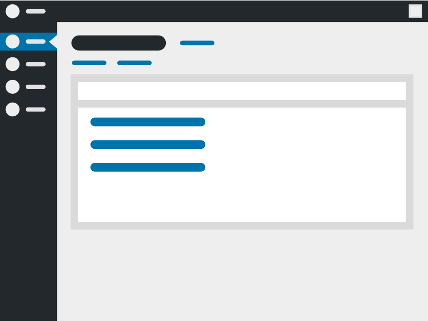

# WordPress Headless Theme
Redirects all front-end requests to the WordPress login page, and disables (or
hides) admin UI elements relating to the front-end. Results in a truly back-end
focused WordPress installation.

## Installation
This theme requires no compilation. Simply [download a zip from releases][1],
and install that into WordPress (In admin, browse to Appearance > Themes,
click 'Add new', and then 'Upload Zip').

[1]: https://gitlab.com/soup-bowl/wp-headless-theme/tags